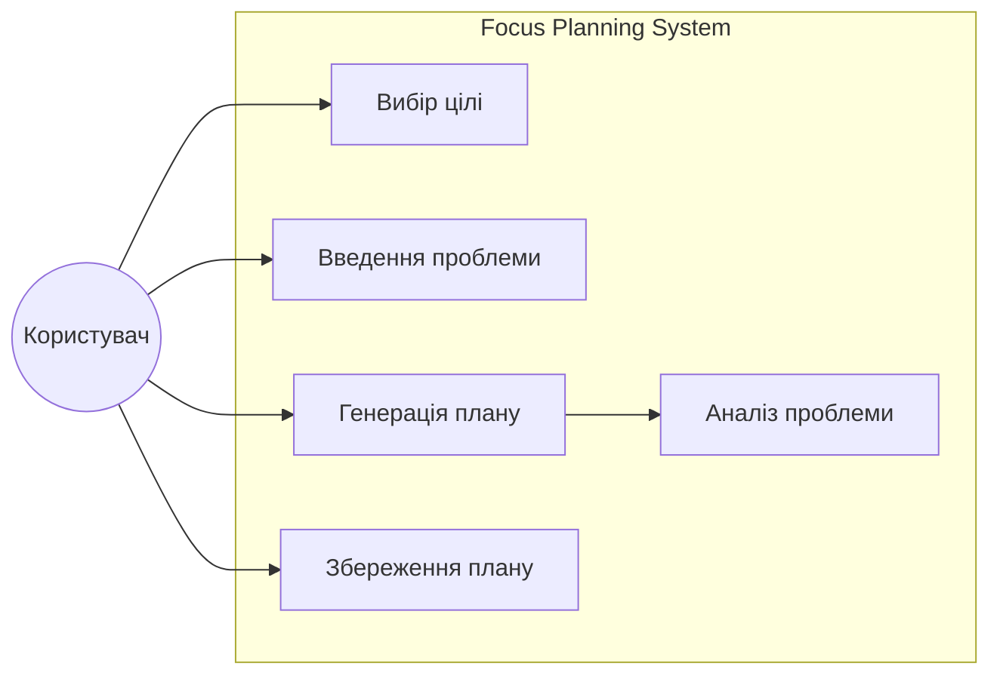
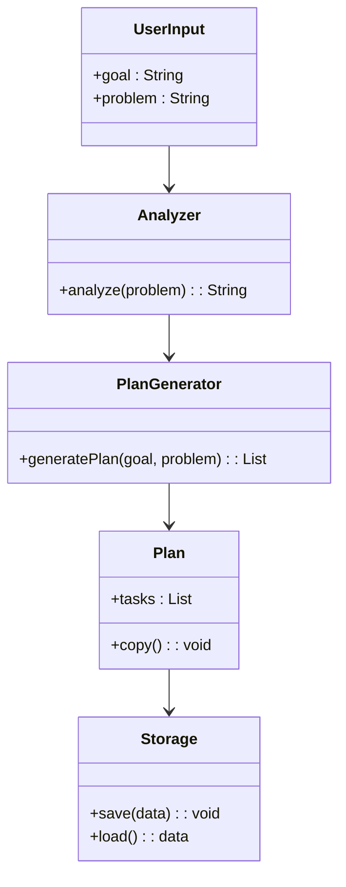
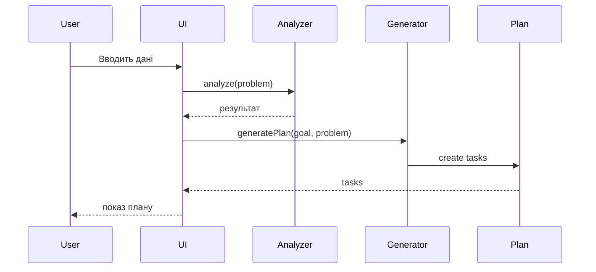

# UML Lab 2 — Focus Planning System

## Introduction

Це веб-сайт, який допомагає починаючим підприємцям сфокусуватися на головному.
Система дозволяє обрати одну цільову аудиторію, визначити основну проблему
та автоматично створити план дій на 7 днів.

## Functional Requirements

* FR-01: Сайт працює без реєстрації
* FR-02: Користувач може обрати лише одну ціль
* FR-03: Користувач вводить свою проблему
* FR-04: Система аналізує проблему
* FR-05: Система генерує план на 7 днів
* FR-06: Користувач може зберегти план

## Use Case Diagram

## Class Diagram

## Sequence Diagram

## Traceability Matrix

| Requirement | Use Case | Classes                       | Sequence |
| ----------- | -------- | ----------------------------- | -------- |
| FR-01       | —        | —                             | —        |
| FR-02       | UC1      | UserInput                     | —        |
| FR-03       | UC2      | UserInput                     | —        |
| FR-04       | UC3      | Analyzer                      | —        |
| FR-05       | UC4      | PlanGenerator, Plan, Analyzer | SD-01    |
| FR-06       | UC5      | Plan, Storage                 | —        |
